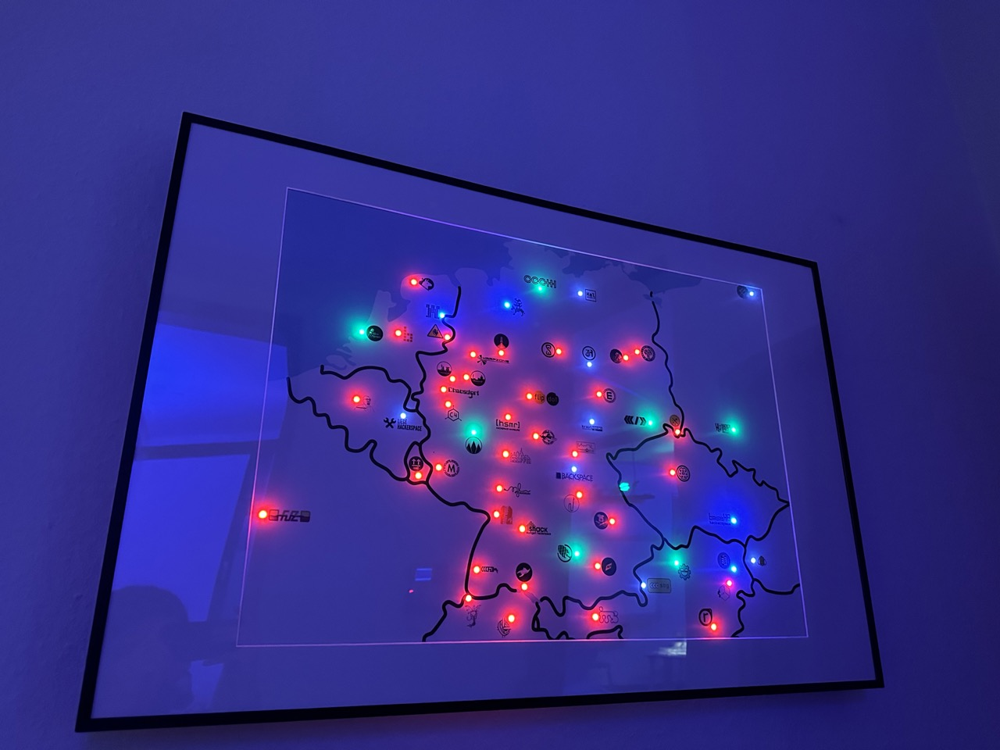
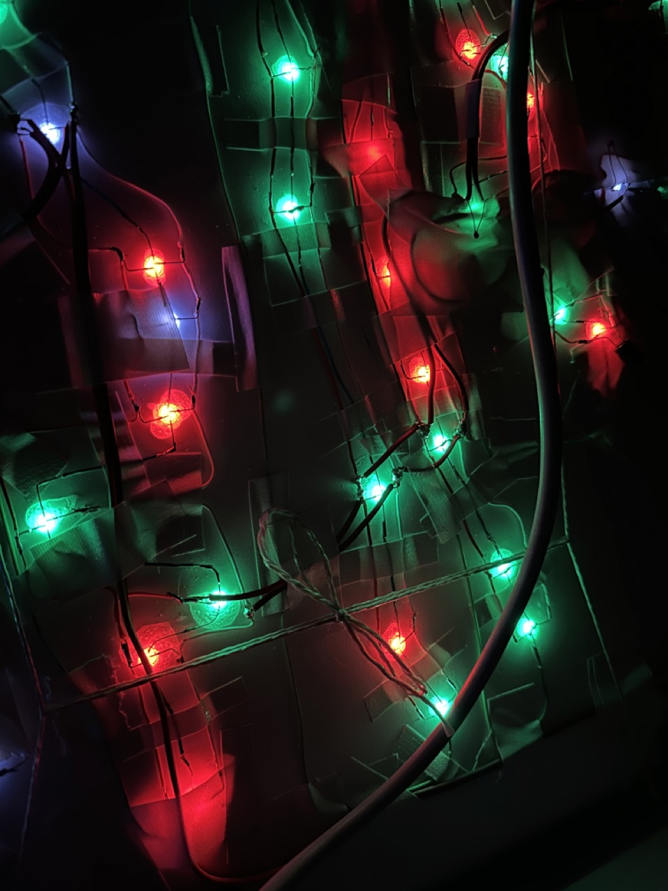

# spacemap

This Arduino sketch displas the current status of Hackspaces according to the [SpaceAPI directory](https://api.spaceapi.io/).

## Hardware
We are using an NodeMCU ESP8266 board, the LEDs are PL9823 RGB LEDs that are cotrolled using the NeoPixelbus library. SpaceAPI data is fetched using the ArduinoJson library in chunked streaming mode.

## Adding your Space to our map
Ask a member for the stash of LEDs, unmount the map, carefuly remove the transparent cover, paint/sticker your space logo on the map, drill a hole, glue and solder the LED, mount the map again, extend the list in main.ino, flash the firmware and you are done.
